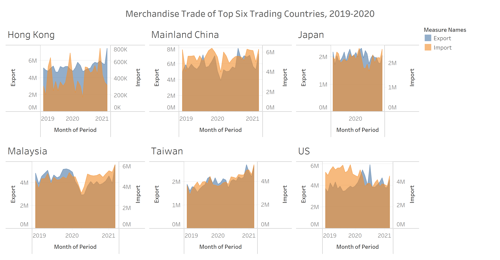
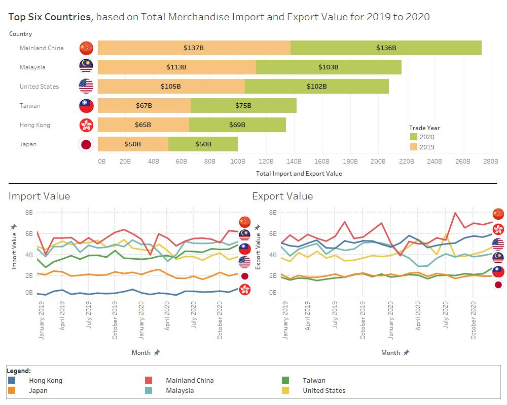

```{r setup, include=FALSE}
knitr::opts_chunk$set(echo = FALSE)
```

# 1. Introduction


Merchandise Trade data collated by the Department of Statistics Singapore, comprising of total imports/ exports since January 1976, is published on [here](https://www.singstat.gov.sg/find-data/search-by-theme/trade-and-investment/merchandise-trade/latest-data). The data is segregated into various regions and countries. We were given a graph depicting the merchandise trade imports/exports for six countries over 2019 and 2020.



###### Figure 1: Original Visualisation depicting trades of six countries from 2019 - 2020

# 2. Visualisation Critiques

## 2.1 Clarity

### 2.1.1 **No Clarity in Title**
The title suggested *Merchandise Trading of Top Six Trading Countries, 2019 - 2020*. However, it was not clear in suggesting how the six countries were accounted for, as top six trading countries. For a layman, the ambiguity could suggest that the countries could be defined as top six trading countries by total import/export trading volume, total import/export trading value, total import volume/ value, total export volume/ value etc.

### 2.1.2 **No Clarity on Period of Measure**
The title suggested a period of measure, *2019 - 2020*. However, under the period scale (x-axis) for the countries, month of period (2019 to 2021), less Japan, was shown. While the title suggested *month of period*, no indications of months were provided.

### 2.1.3 **Incomplete Data Visualisation for Japan**
The title suggested that the data would comprise of data from 2019 to 2020. However, under the chart depicting Japan, only "2020" was shown at *Month of Period*.

## 2.2 Aesthestics

### 2.2.1 **Incorrect Usage of Graphs**
The graphs attempted to use an area graph to depict the import and export values of the respective countries. Such area graph is suitable to depict profit over revenue, when we need visualisation to suggest when would the revenue turn profitable. In addition, profit is a result from revenue, after taking into account other costs and expenses. However, imports and exports are not a result from either one another. Therefore, such a graph is not suitable to depict the import/export value.

### 2.2.2 **Unsuitable Usage of Colours**
The graphs attempted to use 2 colours to differentiate between import and export value. However, using an incorrect graph will see the value of imports and exports being overlaid with each other, forming a different shade of colour. Although only two colours were used, a third shade of colour appeared, thus creating confusion for readers.

### 2.2.3 **Inept for Intuitive Comparison Among Countries**
The graphs are separated into six different charts and it does not allow the users to intuitively compare the import/export values among the countries. In addition, the reader is unable to comprehend the the pegging order of the six countries, in terms of the total value of import and export for the period 2019 to 2020.

### 2.2.4 **Inconsistent Intervals across and within Charts**
At first glance, the six different charts may suggest that the six countries are having similar trade value from 2019 - 2020. However, upon closer examination, the charts do not have a consistent intervals for the Export value. Similarly, a quick glance may suggest that trade value between imports and exports seem to differ slightly. But it was attributed to different interval scales within the chart itself. Such inconsistencies would not allow the reader to pick up the correct information, and worse, misled the readers.

### 2.2.5 **Missing Intervals to Indicate Month of Period**
The x-axis of the graphs was labelled as *"Month of Period*. However, there are no interval ticks to suggest to indicate the various months.

# 3. Proposing an Improved Visualisation

With the above critiques, I would be suggesting an alternate graphical presentation to better present the data to a wider audience. The proposed layout of the improved visualisation is as stated below:


The improved visualisation would achieve the following:

# 4. The Improved Viualisation

The improved visualisation would address all the critiques and provide visual enhancements. The improvements include:

* Providing **clarity in the title heading**, to suggest that the top size countries were chosen based on total trade value, imports and exports, from 2019 to 2020. This is further enhanced by sorting the countries by their trade value.
* Providing **interval marks for months** of period from 2019 to 2020, to allow reader to have an indication the trade value (import/export) for the particular month made by a specific country.
* Ensuring **all six countries depicts the trade value** from 2019 to 2020.
* Providing **3 separate charts** to allow reader to visualise the data better:

  + Chart 1: Using **horizontal bar chart to displaying the total trade value** (imports and exports) from 2019 to 2020, sorted in descending order for trade value.
  + Chart 2: Using **line graph to depict the import value of various countries**, differntiated by varying colours, from 2019 to 2020.
  + Chart 3: Using **line graph to depict the export value of various countries**, differntiated by varying colours, from 2019 to 2020.

* The import and export chart would use **consistent intervals at the y-axis** across both charts, so as to allow the reader to:

  + Intuitively compare the trade value **among the six countries**.
  + Intuitively compare the import and export value of the **same country**.
  + Intuitively **rank the countries** in accordance to trade value, import value and export value, separately.
  

  
# 5. Step-by-Step Description on how the Improved Visualisation was prepared

## 5.1 Data Preparation

### 5.1.1 Using Tableau Data Interpreter
{width=30%}
{width=32%}

Tableau Data Interpreter will attempt to identify the structure of the Excel file and convert it into a suitable format for Tableau processing. There are 3 worksheets inside the Excel file, *Content*, *T1* and *T2*. For thise exercise, we will be using T1 and T2.

### 5.1.2 Preparing T1 and T2

Upon examining T1, it was observed that it contains all the Merchandise Trading **Imports** from various countries and regions from Jan 1976. However, the data is organised such that every observations (rows) represents the trade value of a specific country/ region from Jan 1976. This would not be suitable for our analysis. Therefore, there is a need to pivot the data such that we have two variables, *Month of Trade* and *Value*. To pivot the table:

* Select all observations, less *Variables*
* Right-click and select *Pivot*


### 5.1.3 Adjust Variable Names and Types

#### Month of Period
While the **Month of Period** of import is recorded as *Month (MMM) and Year (YYYY)*, Tableau identified it as a *string* format. Therefore, there is a need to adjust it into a *Date* format. To do this:

* Click on the *Abc*
* Click on Date

{width=50%}
* Rename the Dimension as Month (Import)

#### Rename Variables
The countries/ regions are described as *Variables*. To rename:

* Click on the Column
* Right-Click and choose *Rename*
* TYpe *Country (Import)*


#### Creating Calculated Field
The Merchandise Trading Value are depicted in Thousands of Dollars ('000). To depict the exact value for computation and display, we need to create a calculated field. To do this:

* Hover the cursor to the *down-arrow* at the column variable
* Click on *Create Calculated Field*
* Name it as *Import Value*
* Under the input box, type [Pivot Field Values] * 1000
* Click on *OK*

{width=75%}

A new column, *Import Value* would be created, with the adjusted value.

{width=75%}

Now that the Data Preparation for T1 is completed, **proceed to do the same for T2** that accounts for the Merchandise Trading Export Value.

## 5.2 Exploratory Data Analysis
There is a need to examine the data, to determine whether the six countries, highlighted, are indeed the top six countries in terms of total Merchandise Trading Value for 2019 to 2020.

Create a new worksheet, naming it as *Total 6 Countries*, and create a new calculated field.

* Under the Data Pane, click on the down arrow

* Click on Create Calculated Field
* Type *Total Import/Export Value* for the Dimension Name
* Under the input box, type *[Import Value] + [Export Value]*

* Click OK

Now we are ready to create the **first Data Visualisation Worksheet**.

We need to narrow the data **to contain only records from 2019 to 2020**. We can use the filter option to achieve this. To do this:

* Drag the Month (Import) into the *Filter Pane*, and then choose *Years* and click *Next*
