```{r setup, include=FALSE}
knitr::opts_chunk$set(echo = FALSE)
```

# 1. Introduction


Merchandise Trade data collated by the Department of Statistics Singapore, comprising of total imports/ exports since January 1976, is published on [here](https://www.singstat.gov.sg/find-data/search-by-theme/trade-and-investment/merchandise-trade/latest-data). The data is segregated into various regions and countries. We were given a set of visualisation, based on the data, and was tasked to provide critiques and to further suggest how to better improve the visualisation. The original visualisation is represented below:


# 2. Visualisation Critiques

## 2.1 Clarity

### 2.1.1 **Contradicting Numbers regarding Net Trading Markets** 
Hong Kong was indicated as Singapore's Top Exporter while Taiwan was indicated as Singapore's Top Importer at $69Bn and $75.2Bn respectively. However, many other countries/ regions were listed with higher numbers such as $102.4Bn (United States), $90.1 Bn (EU), $103.5 mil (Malaysia) and $136.2Bn (China). This create a confusion for the readers to evaluate whether Hong Kong/ Taiwan were the top exporter/importer markets while other countries/ region having a seemingly larger numbers may suggest a higher net trade balances. What is missing from the graph, is the net trade balances of the respective markets. By indicating the net trade balances from the markets, it would present a more convincing picture.


### 2.1.2 **Missing Title, Objective and Period of Measure**
While the graph bears a central theme towards a Net Importer and Net Exporter country, it failed to suggest the period of measure. In one of its caption, the focus was on Mainland China in 2009 while the other was on US in 2006. The reader would not be able determine the period of measure for this visualisation and the additional caption, without context, would further confuse the readers.


### 2.1.3 **Unknown Selection Criteria for Trading Countries/ Markets**
The graph listed the trading information of 10 countries/ region/ markets. There were no mentioning of the selection criteria of the 10 trading markets. While some are countries, it included a EU region, comprising of several EU nations. Therefore, it may baffle the readers on the comparison factors/ considerations into selecting the trading markets in the graph.

### 2.1.4 **Net Importers/ Exporters**
At the bottom right of the graph, a label suggesting "Net Exporters" and at the top left of the graph, a label suggesting "Net Importers" were not clear in its purposes. While it may refer to the net import/export from the respective trade markets, it was not indicative of the period of measure for this summation. There is no indication of the date duration for this summation.


## 2.2 Aesthestics

### 2.2.1 **Incorrect Placement of Imports/Exports Icon**
From the graph, it was assumed that the x-axis referred to the total exports to the trade markets, while the y-axis represented the total imports from the trade markets. While the colour sequence of the imports (blue) and exports (green), matched the scale and area, the placement of imports and exports icon at the beginning of x-y scale could be better. While the respective icons was meant to indicate the line of scale - blue scale represented by imports (thus being placed at the start of the line), and green scale represented by exports (thus being placed at the start of the line), intuitively, that is not how a reader may interpret the labels.


### 2.2.2 **Inconsistent Placement and Overlapping of Tooltip Info**
The graph attempted to annotate the details of the trade markets' total trade volume. However, it is contradiction with the concluding information, which was supposed to suggest net trade volume. The annotation was also in the way of the trade market's bubble, thus making the reading of the graph difficult. In addition, the center white circle, that was supposed to represent the net trade balance, was not visible on some of the trade markets' bubbles.


### 2.2.3 **Graph Layout**
The graph had four components: (a) the visualisation graph; (b) definition of the graph; (c) legend; and (d) insight. While all four components were suggesting along the same topic on net trade surplus/deficit, the placement of the components and the visualisation of the graph was not intuitive for readers. For instance, the size of the bubble were premised on the net trade volume(summation of imports and exports). The legend was focusing on the net importer and exporter while the insights were referencing US and Mainland China. Therefore, the layout of the graph would need to be consistent and intuitive, so that the readers is able to understand the infographics intuitively, without much processing and cross-referencing.

# 3. Proposing an Improved Visualisation
With the above critiques, I would be suggesting an alternate graphical presentation to better present the data to a wider audience. The proposed layout of the improved visualisation is as stated below:

# 4. The Improved Visualisation
The improved visualisation would address all the critiques and provide visual enhancements. The improvements include:

# 5. Step-by-Step Description on how the Improved Visualisation was prepared

## 5.1 Data Preparation

### 5.1.1 Getting Started with Tableau Prep Builder
We could use Tableau Prep Builder to prepare and to clean the data. Do the following steps:

* Open the Excel file

* Check on "Use Data Interpreter" to allow Tableau to best-interpret the excel worksheets.
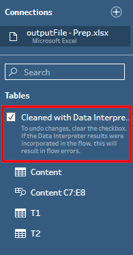
* Double click on T1 and T2, to load both worksheets. The final screen should look like this:
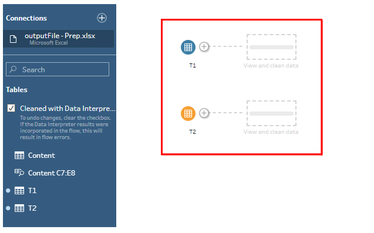

### 5.1.2 Cleaning T1 and T2
We will now commence to clean T1. Click on "View and clean data":
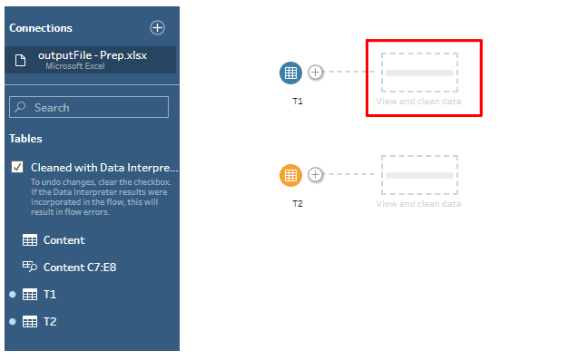
Since we are looking at data from Jan 2011, we will proceed to delete all columns before Jan 2011. To do that, click on the column at "1976 Jan" and Shift+click "2010 Dec". This will select all the columns. Right click on any of the selected columns, and click on remove. Do the same for Jan 2021 to Apr 2021.
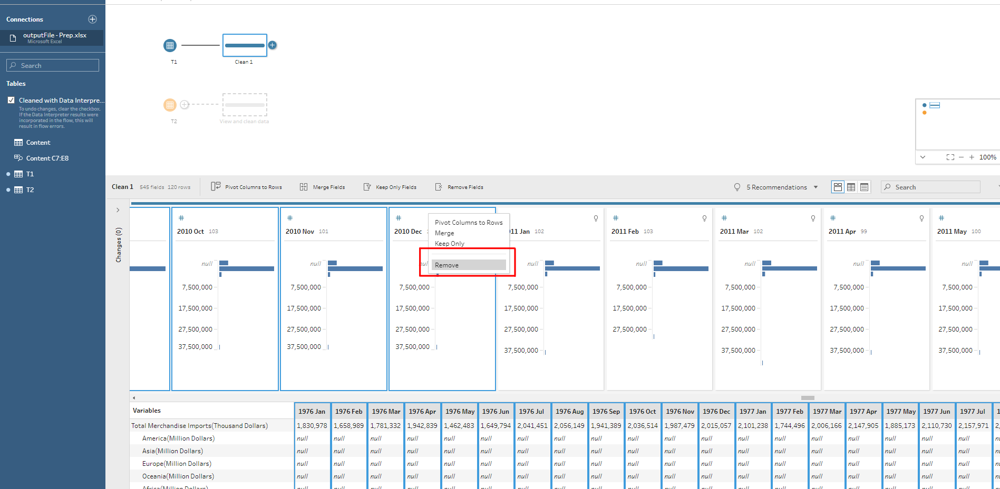
There is a need to pivot the table, such that the columns are now referred to as rows. To do that, select all the columns, less "Variables". Right click on any of the selected column and choose "Pivot Columns to Rows"
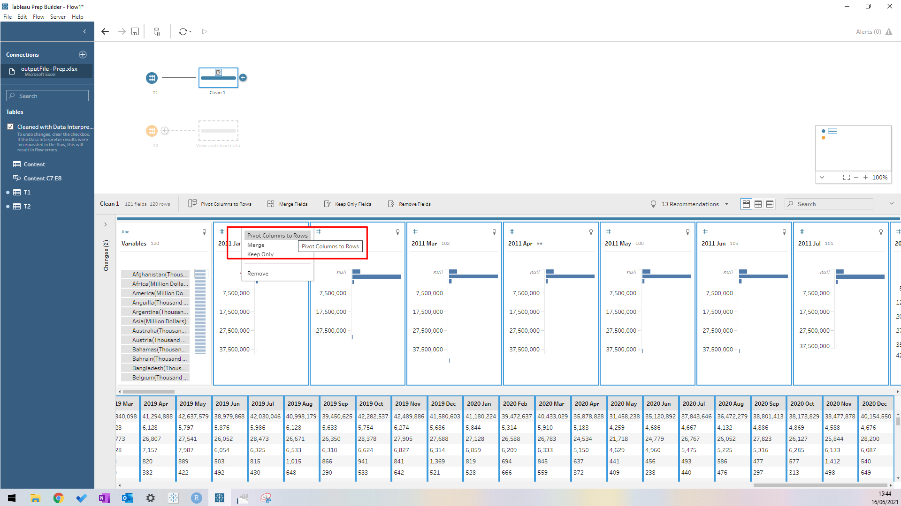
Inside the worksheet, there is a row that indicates the Total Merchandise Imports. Similarly, there are collated information based on regional imports. To avoid repetitions but to keep regional information (Africa, Asia, Americas etc), choose "Total Merchandise Imports" and click on "exclude".
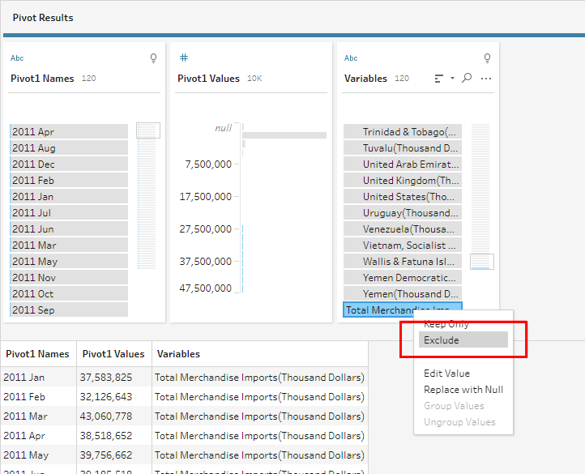
The trading markets are currently listed with unnecessary information such as, "Thousand Dollars". To remove them, we could use Tableau Automatic Split function to trim the data. Right click on "Variables" and then choose "Split Values" -> "Automatic Split"
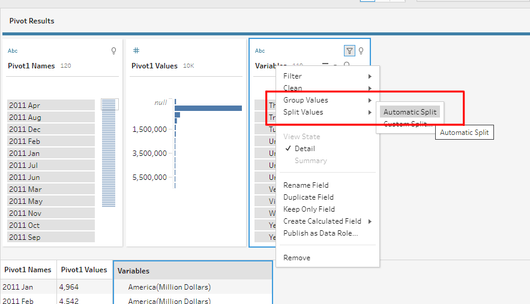
With there, there is a series of adjustments that we need to make for T1:

1. Rename "Variables - Split 1" to "Import Market"
2. Remove "Variables - Split 2" column
3. Rename Pivot1 Names to "Import Month"
4. Change the format of Import Month from "String" to "Date"
5. Rename Pivot1 Values to "Import Value"
6. Remove "Variables" column

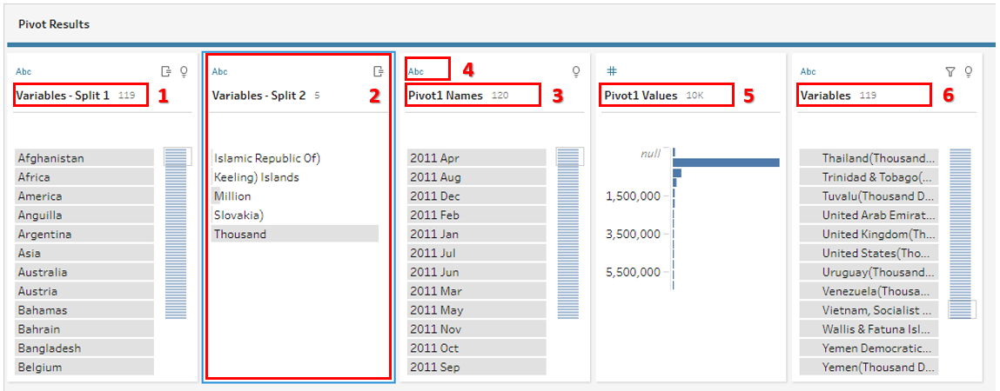

The final table for T1 should look like this:

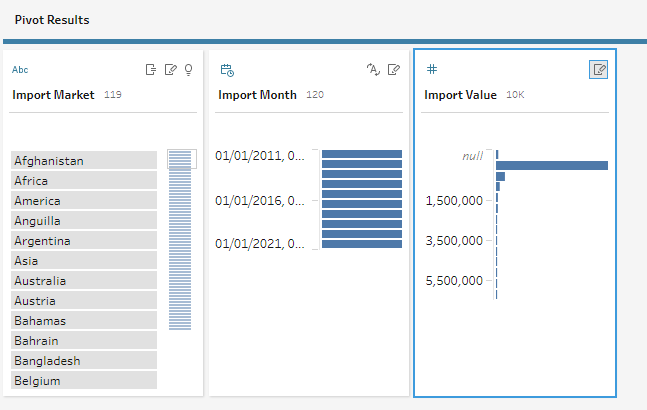

We will proceed to do similar steps for T2.

The final screen should look like this:

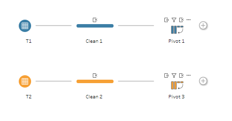

### 5.1.3 Creating Union between T1 and T2
There is a need to create a union between T1 and T2. To do this, drag T1 Pivot into T2 Pivot and ensure that the word "join" is highlighted.

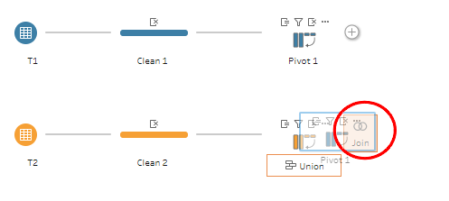

Next, go to Settings, and join the following fields together:

* Export Market = Import Market
* Export Month = Import Month

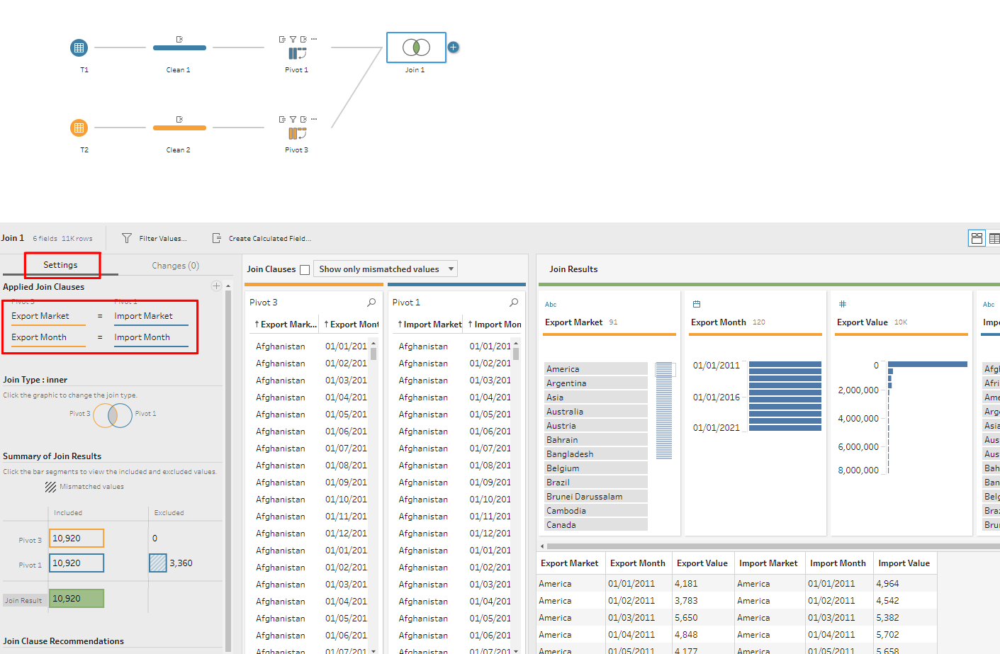

### 5.1.4 Saving the Cleaned Data into a new Worksheet

Once the join is complete, we can export the file into Excel, to be used in Tableau. To do so, click on the 'plus' sign and choose Output.

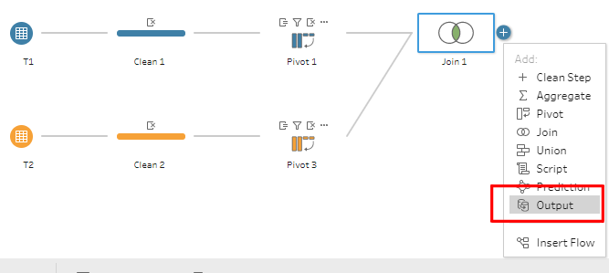

To create an output to Excel, do the following under the settings pane:

1. Ensure "Microsoft Excel (.xlsx) is selected
2. Browse and locate the original Excel file
3. Type "prep" and click on "Create new worksheet "Prep"

Once that is done, click on "Run Flow"

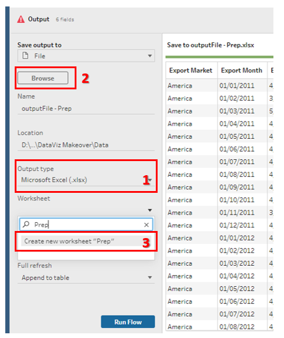{width=50%}

Now, a new worksheet has been created inside the original Excel file. We can proceed to use the worksheet to create the Visualisation inside Tableau.

## 5.2 Building the Visualisation
