```{r setup, include=FALSE}
knitr::opts_chunk$set(echo = FALSE)
```

# 1. Introduction


Merchandise Trade data collated by the Department of Statistics Singapore, comprising of total imports/ exports since January 1976, is published on [here](https://www.singstat.gov.sg/find-data/search-by-theme/trade-and-investment/merchandise-trade/latest-data). The data is segregated into various regions and countries. We were given a set of visualisation, based on the data, and was tasked to provide critiques and to further suggest how to better improve the visualisation. The original visualisation is represented below:


# 2. Visualisation Critiques

## 2.1 Clarity

### 2.1.1 **Contradicting Numbers regarding Net Trading Markets** 
Hong Kong was indicated as Singapore's Top Exporter while Taiwan was indicated as Singapore's Top Importer at $69Bn and $75.2Bn respectively. However, many other countries/ regions were listed with higher numbers such as $102.4Bn (United States), $90.1 Bn (EU), $103.5 mil (Malaysia) and $136.2Bn (China). This create a confusion for the readers to evaluate whether Hong Kong/ Taiwan were the top exporter/importer markets while other countries/ region having a seemingly larger numbers may suggest a higher net trade balances. What is missing from the graph, is the net trade balances of the respective markets. By indicating the net trade balances from the markets, it would present a more convincing picture.


### 2.1.2 **Missing Title, Objective and Period of Measure**
While the graph bears a central theme towards a Net Importer and Net Exporter country, it failed to suggest the period of measure. In one of its caption, the focus was on Mainland China in 2009 while the other was on US in 2006. The reader would not be able determine the period of measure for this visualisation and the additional caption, without context, would further confuse the readers.


### 2.1.3 **Unknown Selection Criteria for Trading Countries/ Markets**
The graph listed the trading information of 10 countries/ region/ markets. There were no mentioning of the selection criteria of the 10 trading markets. While some are countries, it included a EU region, comprising of several EU nations. Therefore, it may baffle the readers on the comparison factors/ considerations into selecting the trading markets in the graph.

### 2.1.4 **Net Importers/ Exporters**
At the bottom right of the graph, a label suggesting "Net Exporters" and at the top left of the graph, a label suggesting "Net Importers" were not clear in its purposes. While it may refer to the net import/export from the respective trade markets, it was not indicative of the period of measure for this summation. There is no indication of the date duration for this summation.


## 2.2 Aesthestics

### 2.2.1 **Incorrect Placement of Imports/Exports Icon**
From the graph, it was assumed that the x-axis referred to the total exports to the trade markets, while the y-axis represented the total imports from the trade markets. While the colour sequence of the imports (blue) and exports (green), matched the scale and area, the placement of imports and exports icon at the beginning of x-y scale could be better. While the respective icons was meant to indicate the line of scale - blue scale represented by imports (thus being placed at the start of the line), and green scale represented by exports (thus being placed at the start of the line), intuitively, that is not how a reader may interpret the labels.


### 2.2.2 **Inconsistent Placement and Overlapping of Tooltip Info**
The graph attempted to annotate the details of the trade markets' total trade volume. However, it is contradiction with the concluding information, which was supposed to suggest net trade volume. The annotation was also in the way of the trade market's bubble, thus making the reading of the graph difficult. In addition, the center white circle, that was supposed to represent the net trade balance, was not visible on some of the trade markets' bubbles.


### 2.2.3 **Graph Layout**
The graph had four components: (a) the visualisation graph; (b) definition of the graph; (c) legend; and (d) insight. While all four components were suggesting along the same topic on net trade surplus/deficit, the placement of the components and the visualisation of the graph was not intuitive for readers. For instance, the size of the bubble were premised on the net trade volume(summation of imports and exports). The legend was focusing on the net importer and exporter while the insights were referencing US and Mainland China. Therefore, the layout of the graph would need to be consistent and intuitive, so that the readers is able to understand the infographics intuitively, without much processing and cross-referencing.

# 3. Proposing an Improved Visualisation
With the above critiques, I would be suggesting an alternate graphical presentation to better present the data to a wider audience. The proposed layout of the improved visualisation is as stated below:


# 4. The Improved Visualisation
The improved visualisation would address all the critiques that were mentioned above. In addition, we would maintain the existing bubble plot, with the added enhancements:

* The reader would be able to select the year of trade.
* The size of the bubble will correspond with the trade market's net trade volume. For instance, if the trade market is a net importer, the net trade volume would reflect the net import value.
* A dynamic tooltip would provide additional information of the selected trade market. It would display:

  + Trade Year
  + Trade Market
  + Net Trade Volume
  + Past Trade information from 2011 to 2020
* The Top 10 Importers and Exporters would be display, to allow readers to how the trade markets had evolved over the years.

# 5. Step-by-Step Description on how the Improved Visualisation was prepared

## 5.1 Data Preparation

### 5.1.1 Getting Started with Tableau Prep Builder
We could use Tableau Prep Builder to prepare and to clean the data. Do the following steps:

* Open the Excel file

* Check on "Use Data Interpreter" to allow Tableau to best-interpret the excel worksheets.

* Double click on T1 and T2, to load both worksheets. The final screen should look like this:


### 5.1.2 Cleaning T1 and T2
We will now commence to clean T1. Click on "View and clean data":

Since we are looking at data from Jan 2011, we will proceed to delete all columns before Jan 2011. To do that, click on the column at "1976 Jan" and Shift+click "2010 Dec". This will select all the columns. Right click on any of the selected columns, and click on remove. Do the same for Jan 2021 to Apr 2021.

There is a need to pivot the table, such that the columns are now referred to as rows. To do that, select all the columns, less "Variables". Right click on any of the selected column and choose "Pivot Columns to Rows"

Inside the worksheet, there is a row that indicates the Total Merchandise Imports. Similarly, there are collated information based on regional imports. To avoid repetitions but to keep regional information (Africa, Asia, Americas etc), choose "Total Merchandise Imports" and click on "exclude".

The trading markets are currently listed with unnecessary information such as, "Thousand Dollars". To remove them, we could use Tableau Automatic Split function to trim the data. Right click on "Variables" and then choose "Split Values" -> "Automatic Split"

With there, there is a series of adjustments that we need to make for T1:

1. Rename "Variables - Split 1" to "Import Market"
2. Remove "Variables - Split 2" column
3. Rename Pivot1 Names to "Import Month"
4. Change the format of Import Month from "String" to "Date"
5. Rename Pivot1 Values to "Import Value"
6. Remove "Variables" column


The final table for T1 should look like this:


We will proceed to do similar steps for T2.

The final screen should look like this:


### 5.1.3 Creating Union between T1 and T2
There is a need to create a union between T1 and T2. To do this, drag T1 Pivot into T2 Pivot and ensure that the word "join" is highlighted.


Next, go to Settings, and join the following fields together:

* Export Market = Import Market
* Export Month = Import Month


### 5.1.4 Removing Repeated Columns
Since Imported Market and Exported Market, and Imported Month and Exported Month are the same, we would delete one of the column, and rename them instead.

* Rename **Import Month** to **Month**
* Rename **Import Market** to **Market**
* Remove **Export Month**
* Remove **Export Market**

### 5.1.5 Saving the Cleaned Data into a new Worksheet

Once the join is complete, we can export the file into Excel, to be used in Tableau. To do so, click on the 'plus' sign and choose Output.


To create an output to Excel, do the following under the settings pane:

1. Ensure "Microsoft Excel (.xlsx) is selected
2. Browse and locate the original Excel file
3. Type "prep" and click on "Create new worksheet "Prep"

Once that is done, click on "Run Flow"

{width=50%}

Now, a new worksheet has been created inside the original Excel file. We can proceed to use the worksheet to create the Visualisation inside Tableau.

## 5.2 Building the Visualisation

### 5.2.1 Creating Calculated Fields
There is a need to create various calculated fields, so that we could calculated the following:

* Total Trade Volume
* Top Importer
* Top Exporter
* Net Trade

To do so, go to the Data Pane, click on the down arrow and choose "Create Calculated Field"
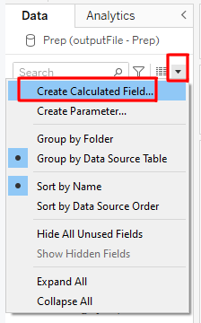{width=30%}

* Creating **Total Trade** Calculated Field

{width=50.5%} 

* Creating **Top Importers** Calculated Field

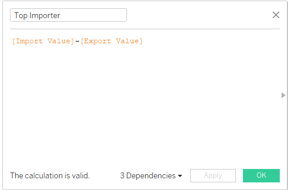{width=50%}

* Creating **Top Exporters** Calculated Field

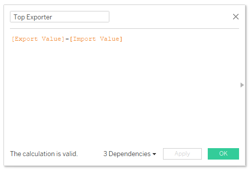{width=50%}

* Creating **Absolute Net Trade** Calculated Field

{width=50%}

### 5.2.2 Creating Top 10 Importers Chart

To create a graph plot, to list the top 10 Importers, we can do the following:

* Drag **Top Importer** into the **Rows**
* Drag **Market** into the **Columns**
* Drag **Market** into the **Color**
* Drag **Market** into the **Filters**
* Right click on Filters -> Market and choose **Edit Filter**

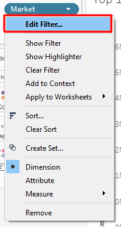{width=30%}

* Go to **Top** Tab
* Choose **By Field**
* Adjust the filter to select the Top 10 Importers

{width=50%}

Next we will go to the **Rows**, select **Market** and then click on **Sort**

{width=50%}

Adjust the following parameters:

* Sort By: Field
* Sort Order: Ascending
* Field Name: Top Importer
* Aggregation: Sum

{width=40%}

After the adjustments, the chart should look something like this:


#### 5.2.2.1 Aesthetics

We would proceed to improve the **aesthetics** of this chart. First, we can add the **Net Import Value** into the graph. To do so, we could do the following:

* Drag **Importer** into **Label**
* Right-Click on **SUM(Top Importer)** and click on **Format**
* Under Format, adjust the following parameters:

  + Under Font, choose size 10 and Bold
  
  {width=30%}
  
  + Under Alignment; (1) Horizontal-Centre; (2) Direction-Up; (3) Vertical-Top; and (4) Wrap-Automatic
  
  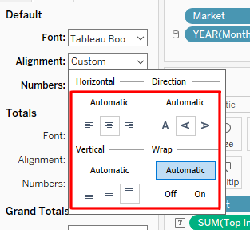{width=30%}
  
  + Under Numbers: (1) Numbers (Custom); (2) Decimal-0; (3) Display Units-Million (M); and Prefix-SGD
  
  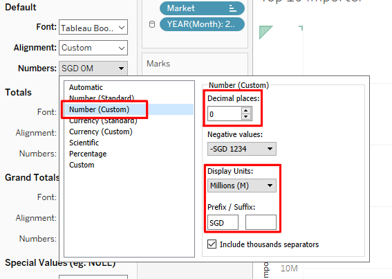{width=50%}

The chart would then show the Top 10 Net Importers into Singapore, cumulated between 2011 and 2020, with **Italy at the 10th spot**. There is a need to know the total net import amount, as this would aid in subsequent building of the charts. To find out the total net import amount from the 10th trading market, right-click on Italy and click on *View Data*. The total net import value for Italy (10th Net Importer) is **41,314,586**

{width=40%} 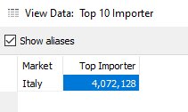{width=30%}
  
Next, we would add the **Year Filter** into the chart. To do so:

* Drag **Month** into Filters
* Select **Years** and click Next; Choose all the values listed inside

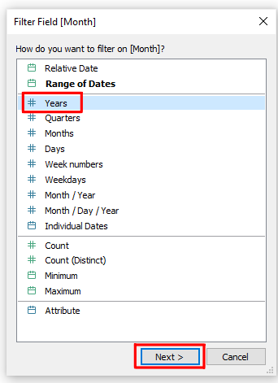{width=30%}

* Right-click on the dimension and click **Show Filter**

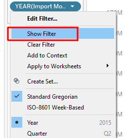{width=30%}

* Right-click on the down-arrow at the filter and click **Single Value (list)**

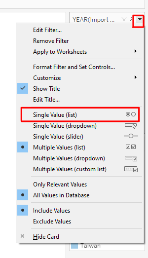{width=30%}

* To allow readers to compare values between years, we will remove the (All) option. To do this, right-click on the down-arrow, select Customised and uncheck the **Show "All" Value**

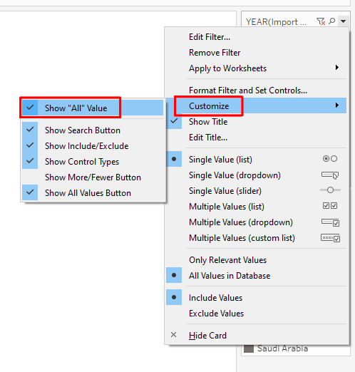{width=30%}

#### 5.2.2.2 Making Minor Adjustments

**Adjustments of Trade Market Names**

For some trade markets, they may be too long, for properly alignment subsequently. Therefore, we will adjust the following market names:

* United States to US
* United Arab Emirates to UAE
* Germany, Federal Republic to Germany

To do so, go to the name of the trade market, right-click and choose **Edit Alias**

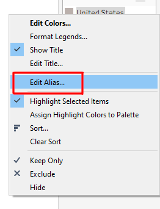{width=30%}

#### 5.2.2.3 Creating Top 10 Exporter Chart

With similar concepts from the creation of Top 10 Importer Chart, we can proceed to do a new Top 10 Exporter Chart. However do that:

* Instead of Sorting it in Ascending Order, **Sort it in Desecnding Order** with the field **Top Exporter**.

### 5.2.3 Bubble Plot for Net Trade

To create the Net Trade Bubble Plot, we would do the following:

* Drag the **Import Value** to **Rows**
* Drag the **Export Value** to **Columns**
* Drag the **Market** to **Color**
  
  + Go to **Condition**, choose **By Formula** and type the following:
  + SUM([Top Importer]) >= 41314586 OR SUM([Top Exporter]) >= 41499315 
  *this will tell Tableau that we are keen to select the Top 10 Importers and the Top 10 Exporters*
  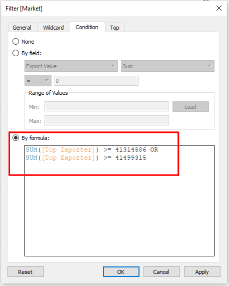{width=50%}
  
* Drag **Net Trade** to **Size**
* Drag **Month** to Filter, choose **Year** and click Next, and Select all Values available.
* Similarly, click on the **Year(Month)** down-arrow and click **Show Filter**

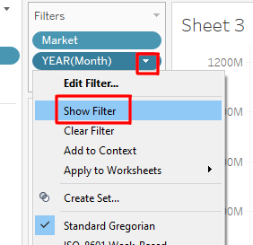{width=30%}

* Similarly, change the filter to radio buttons and disable the **Show "All" Values**

The initial visualisation should look like this:


#### 5.2.3.1 Adding a Diagonal Reference Line
For the Net Trade Bubble Chart, it would be useful to add a diagonal line, such the anything towards the left of the line would suggest that it is an **Market Importer** while anything that is towards the right of the line would suggest that it is an **Market Exporter**

Since Tableau does not have a function to add a diagonal reference line, we would attempt to use **Trending LIne** to server as a reference line. To do that, we would do the following:

* Go to **Analysis** and then switch off **Aggregate Measures**. This will allow Tableau to show all data points, instead of aggregating them.
* Create a **Calculated Field** and rename it as **Diagonal Reference Line**. Inside the field, add **[Export Values]** into it.
* Drag **Market** into Detail and **Import Value** into **Color**
* Drag **DIagonal Reference Line** into **Rows**, placing it next to **Import Value**

{width=50%}

* Click **Diagonal Reference Line** and click on **Dual Axis**

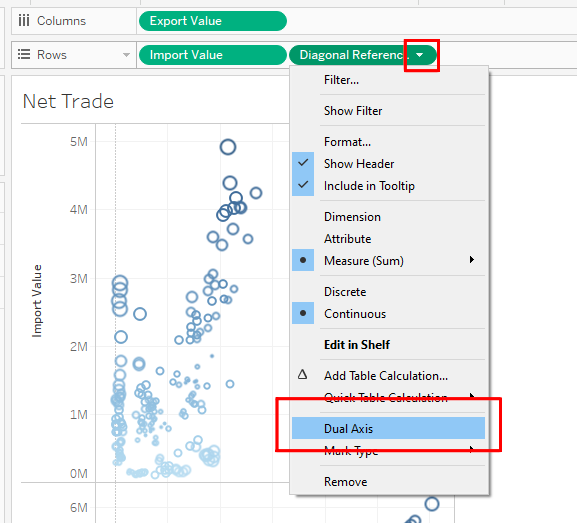{width=50%}

* Right-Click on **Diagonal Reference Line Axis** and choose **Synchronise Axis**

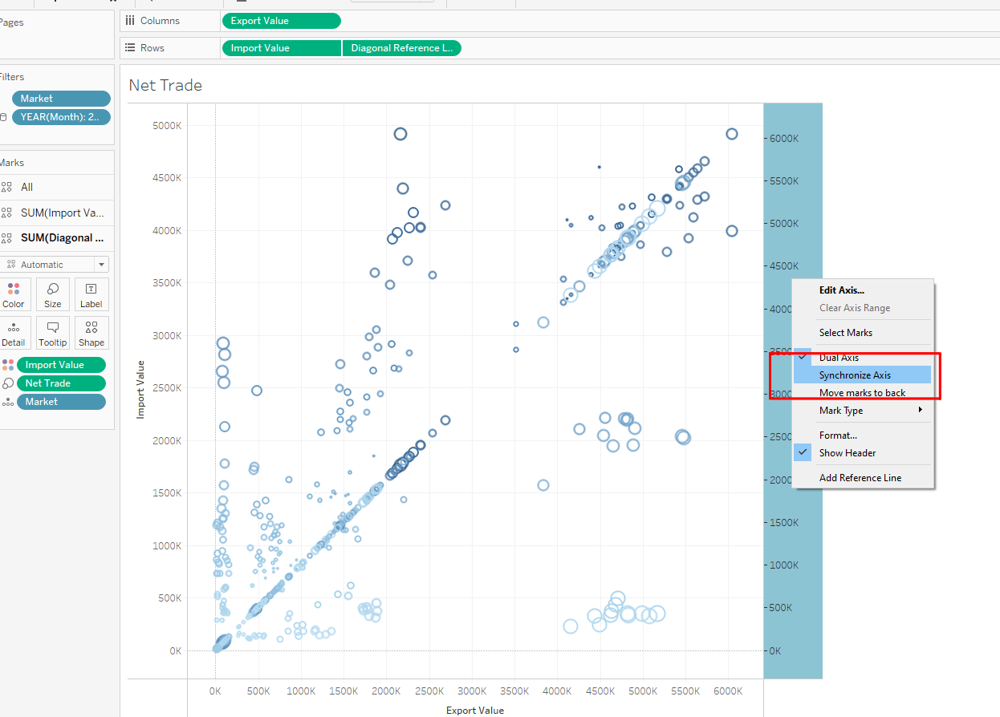

* Go to **SUM(Diagonal Reference Line)** pane, click on **Automatic** and change to **Line**
* Go to one of the lower point, along the plot, right-click, and go to **Trend Lines**, **Show Trend Lines**

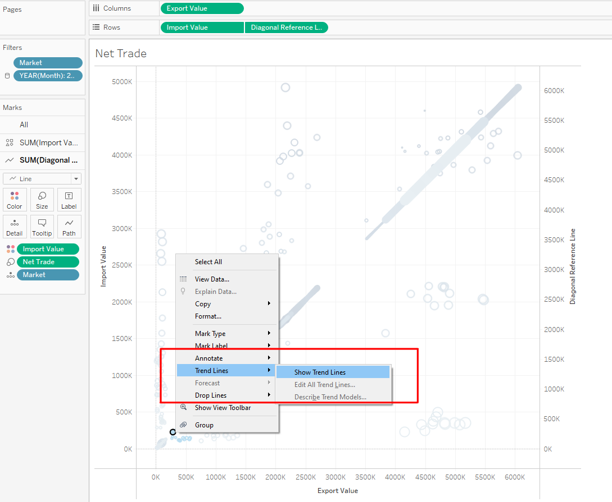{width=90%}

* Click on **Color** and reduce the opacity to 0%.
* Right click on the **Diagonal Reference Line** axis and switch off **Show Header**
* Click on the **Trend Line**, and click **Edit**
* Uncheck on the box **Show tooltips**

{width=30%} {width=40%}

* Synchronise both axes by providing fixed ranges

  + Fixed Start: -5000000
  + Fixed End: 75000000
  
* Go to **SUM(Import Value)** pane, remove **SUM(Import Value)** from **Color** and replace it with **Market**
* Go to **Analysis** and switch on **Aggregated Measures** again. The final screen should look like this.

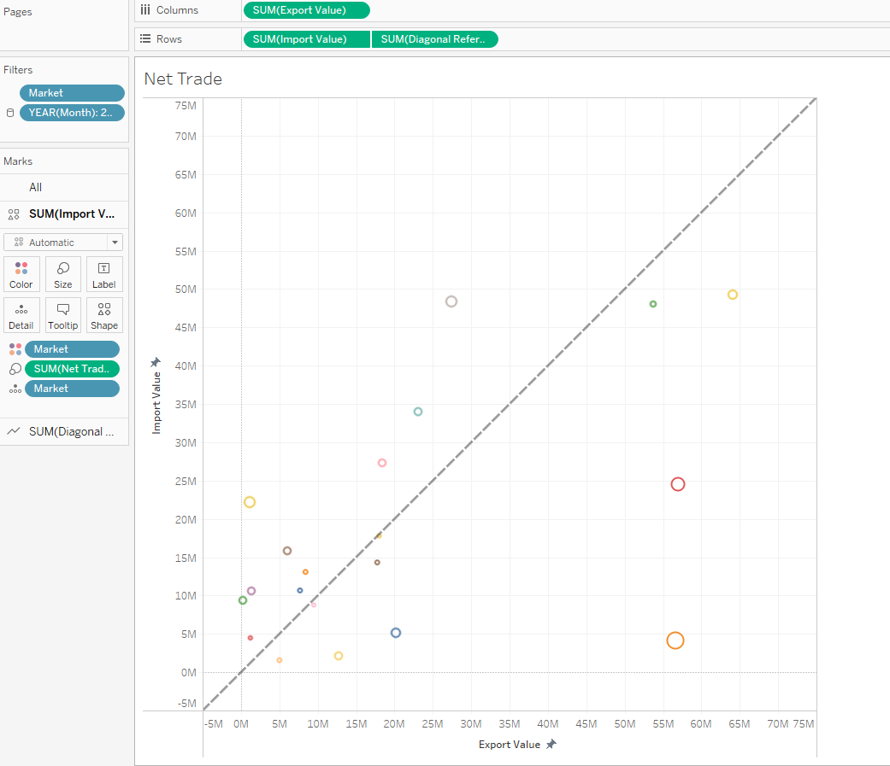

#### 5.2.3.2 Improving the Aesthesics of Net Trade Bubble Chart

A couple of things could be adjusted to make the Bubble Chart more readable and intuitive.

* Change the **Automatic** parameter to a **Circle** parameter
* Adjust the size of the **circle** to about 75%
* Adding **Market** into the labelling, and adjust the labelling to be on top of the bubble

#### 5.2.3.3 Adding Flags to be used as Bubble Chart

To add flags to be presented onto the Bubble Chart, there is a need to download and create a repository for the flags. To download the flags, we could go to [Flaticon](https://www.flaticon.com/). After which, go to Tableau default folder and create a **Flags** folder. This folder would be used to save all the flags.


{width=30%}

Next, do the following:

* Change from the existing Circles to Shapes
* Drag **Market** into Shape
* Right-Click on the Market Legend and choose **Edit Shapes**

{width=30%}

* Click on **Reload Shapes**

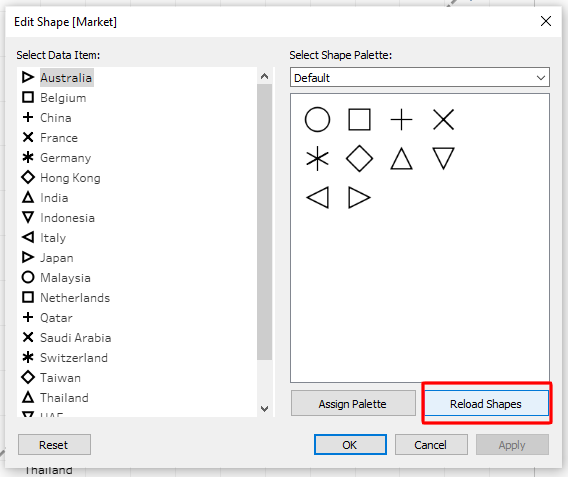{width=30%}

* We should see the Flags category, and assign the flags accordingly.

{width=30%}

The final product should look like this:


#### 5.2.3.4 Enhancing Bubble Plot Tooltip

We would attempt to include  an Import and Export graph, over the past 10 years, to allow users to view the historical data. To do that:

* Create a **new worksheet** and name it as **Import and Export**.
* Drag **Month** to **Columns** and choose **Year**
* Drag **Import Value** to Rows and **Export Value** to the right of the graph.

The graph should look likle this:

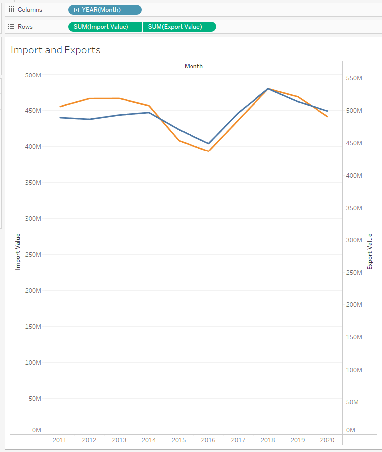{width=50%}

* Synchronise both axes

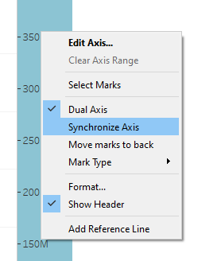{width=30%}

* Resize the chart, and ensure the axes colours are themed in accordance to the colour of the line. The size of the chat should look like this:


* Go back to **Net Trade** worksheet and adjust the tooltip by clicking **Insert** -> **Sheets** -> **Import and Export**. Adjust the maxwidth to 500.

{width=60%} 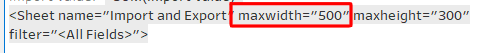
  
The final tooltip should look this:

{width=50%}

### 5.2.4 Creating a new Dashboard

Before the dragging of any worksheets into the dashboard, it is important to ensure that the size of the dashboard is set to **automatic**. To create an interactive dashboard, we would drag the following 3 worksheets into the dashboard"

* Top 10 Importer
* Top 10 Exporter
* Net Trade

Create a new title and label it as **Singapore's Trading Partners (Import/ Export) for 2011 to 2020**.

To allow the respective market to be highlighted, when any trade market is selected at the Bubble Plot, do the following:

* Go to **Dashboard** and click on **Actions**

{width=30%}

* Click on **Add Action** and choose **Highlight**

{width=30%}

* Key in the following:

  + Click on **Select**
  + Under Source Sheets, select **Net Trade** only
  + Under Target Sheets, select **Top 10 Exporter** and **Top 10 Importer**
  
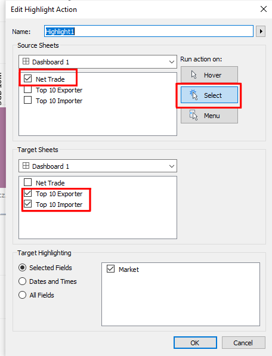{width=50%}

Now, whenever any trade market is selected on the Bubble Chart, the respective Import/Export chart would be highlighted, with the selected market.

*Adding Animation*

Since the reader is able to select between the year of data, it would be useful to add animation to allow the reader to visualise the changes over the years. To do so:

* Go to **Format** -> **Animations**
* Switch it **On** and set duration **1.00 seconds (Flow)**

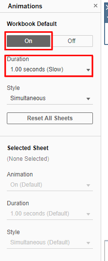{width=30%}

The final dashboard would look like this:


The interactive version could be found [here](https://public.tableau.com/app/profile/davmes.tan/viz/DataViz2a/Dashboard1)

# 6. New Insights from the Improved Visualisation