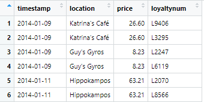
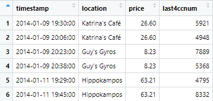

```{r setup, include=FALSE}
knitr::opts_chunk$set(error = FALSE, message = FALSE)
```

```{r packages, include=FALSE}

packages = c('raster', 'sf',
             'clock', 'tidyverse', 
             'tmap', 'rgdal',
             'dplyr', 'ggplot2',
             'ggiraph', 'DT',
             'plotly', 'crosstalk',
             'forcats', 'scales',
             'arules', 'gtable',
             'grid', 'gridExtra',
             'chron', 'lubridate',
             'kableExtra', 'hms',
             'sp')

for(p in packages){
  if(!require(p, character.only = T)){
    install.packages(p)
  }
  library(p, character.only = T)

}

rm(p, packages)

```

# 1. Background

## 1.1 Background Context

Extracted from VAST Challenge 2021 [here](https://vast-challenge.github.io/2021/index.html)

*In the roughly twenty years that Tethys-based GAStech has been operating a natural gas production site in the island country of Kronos, it has produced remarkable profits and developed strong relationships with the government of Kronos. However, GAStech has not been as successful in demonstrating environmental stewardship.*

*In January, 2014, the leaders of GAStech are celebrating their new-found fortune as a result of the initial public offering of their very successful company. In the midst of this celebration, several employees of GAStech go missing. An organization known as the Protectors of Kronos (POK) is suspected in the disappearance, but things may not be what they seem.*

## 1.2 The Challenge

Extracted from VAST Challenge 2021 Mini Challenge 2 [here](https://vast-challenge.github.io/2021/MC2.html).

*Many of the Abila, Kronos-based employees of GAStech have company cars which are approved for both personal and business use. Those who do not have company cars have the ability to check out company trucks for business use, but these trucks cannot be used for personal business.*

*Employees with company cars are happy to have these vehicles, because the company cars are generally much higher quality than the cars they would be able to afford otherwise. However, GAStech does not trust their employees. Without the employees' knowledge, GAStech has installed geospatial tracking software in the company vehicles. The vehicles are tracked periodically as long as they are moving.*

*This vehicle tracking data has been made available to law enforcement to support their investigation. Unfortunately, data is not available for the day the GAStech employees went missing. Data is only available for the two weeks prior to the disappearance.*

*To promote local businesses, Kronos based companies provide a Kronos Kares benefit card to GASTech employees giving them discounts and rewards in exchange for collecting information about their credit card purchases and preferences as recorded on loyalty cards. This data has been made available to investigators in the hopes that it can help resolve the situation. However, Kronos Kares does not collect personal information beyond purchases.*

The objective of this assignment is to assist law enforcement authorities to **ascertain varying purchases made by specific GASTech employees** and to **identify suspicious patterns of behaviour**.

# 2. Data Preparation

There are a total of 3 csv files provided for MC 2. They are:

+ **cc_data.csv**
+ **loyalty_data.csv**
+ **gps.csv**

There were a few issues that was needed to be resolved in both csv files.

+ There is a need to convert the timestamp of all files into a *dttm* format
+ For **cc_data.csv** and **loyalty_data.csv** there are unrecognised characters within the *location* variable. Thus, we would convert it into a UTF-8 readable format.

```{r data_prep_1, include=FALSE}

cc_data <- read_csv("data/cc_data.csv")
loyalty_data <- read_csv("data/loyalty_data.csv")

#convert timestamp from character into date/time format
cc_data$timestamp <- date_time_parse(cc_data$timestamp,
                                     zone = "",
                                     format = "%m/%d/%Y %H:%M")

#convert timestamp from character into date/time format
loyalty_data$timestamp <- date_time_parse(loyalty_data$timestamp,
                                     zone = "",
                                     format = "%m/%d/%Y")

#Amend string text for Katrina's Cafe
cc_data <- cc_data %>%
  mutate(location = str_replace_all(location,
                                    pattern = "Katerin.+",
                                    replacement = "Katrina\x27s Caf\xe9"))
#cc_data <- cc_data2

loyalty_data <- loyalty_data %>%
  mutate(location = str_replace_all(location,
                                    pattern = "Katerin.+",
                                    replacement = "Katrina\x27s Caf\xe9"))
#loyalty_data <- loyalty_data2

```

```{r Heatmap for CC, include=FALSE}

heatmap_cc <- cc_data %>%
  mutate(time60 = round_date(cc_data$timestamp, "60 minutes"),
         daydate = weekdays(timestamp),
         tempdate = timestamp + 8*60*60,
         weekend = chron::is.weekend(tempdate),
         time = format(time60, format = "%H:%M")) %>%
  select(-c(tempdate)) %>%
  group_by(location, daydate, time) %>%
  add_count(location, daydate, time, name = "count")

heatmap_cc_weekday <- heatmap_cc %>%
  filter(weekend == FALSE)

pop_heatmap_cc_weekday <- heatmap_cc %>%
  filter(location == "Abila Zacharo"|
           location =="Brew've Been Served" |
           location == "Gelatogalore" |
           location == "Guy's Gyros" |
           location == "Hallowed Grounds" |
           location == "Hippokampos" |
           location == "Katrina's Café" |
           location =="Ouzeri Elian")

heatmap_cc_weekend <- heatmap_cc %>%
  filter(weekend == TRUE)

pop_heatmap_cc_weekend <- heatmap_cc %>%
  filter(location == "Kalami Kafenion"|
           location == "Guy's Gyros" |
           location == "Hippokampos" |
           location == "Katrina's Café" |
           location =="Ouzeri Elian")

x1 <- length(unique(heatmap_cc_weekday$count))

cc_colours1 <- colorRampPalette(c('green', 'yellow', 'orange', 'red'))(x1)

p1 <- ggplot(heatmap_cc_weekday,
       aes(location, time)) + 
  geom_tile(aes(fill = factor(count))) + 
  scale_fill_manual(values = cc_colours1,
                    name = "Frequency") +
                    #breaks = levels(count)[seq(1, x, by = 5)]) +
  labs(x = "Locations", y = "Time (Static)", title = "Number of CC Transactions during Weekdays") +
  theme(axis.text.x = element_text(size = 8, angle = 45, vjust = 1.1, hjust = 1.1),
        axis.text.y = element_text(size = 7),
        plot.title = element_text(hjust = 0.5))

x1a <- length(unique(pop_heatmap_cc_weekday$count))

cc_colours1a <- colorRampPalette(c('green', 'yellow', 'orange', 'red'))(x1a)

p1a <- ggplot(pop_heatmap_cc_weekday,
       aes(location, time)) + 
  geom_tile(aes(fill = factor(count))) + 
  scale_fill_manual(values = cc_colours1a,
                    name = "Frequency") +
                    #breaks = levels(count)[seq(1, x, by = 5)]) +
  labs(x = "Locations", y = "Time (Static)", title = "Number of CC Transactions during Weekdays") +
  theme(axis.text.x = element_text(size = 8, angle = 45, vjust = 1.1, hjust = 1.1),
        axis.text.y = element_text(size = 7),
        plot.title = element_text(hjust = 0.5))

#svl <- "CC Time Weekday Heatmap.png"
#ggsave(svl)

x2 <- length(unique(heatmap_cc_weekend$count))

cc_colours2 <- colorRampPalette(c('green', 'yellow', 'orange', 'red'))(x2)

p2 <- ggplot(heatmap_cc_weekend,
       aes(location, time)) + 
  geom_tile(aes(fill = factor(count))) + 
  scale_fill_manual(values = cc_colours2,
                    name = "Frequency") + 
                    #breaks = levels(count)[seq(1, x, by = 5)]) +
  labs(x = "Locations", y = "Time (Static)", title = "Number of CC Transactions during Weekends") +
  theme(axis.text.x = element_text(size = 8, angle = 45, vjust = 1.1, hjust = 1.1),
        axis.text.y = element_text(size = 7),
        plot.title = element_text(hjust = 0.5))

x2a <- length(unique(pop_heatmap_cc_weekend$count))

cc_colours2a <- colorRampPalette(c('green', 'yellow', 'orange', 'red'))(x2a)

p2a <- ggplot(pop_heatmap_cc_weekend,
       aes(location, time)) + 
  geom_tile(aes(fill = factor(count))) + 
  scale_fill_manual(values = cc_colours2a,
                    name = "Frequency") + 
                    #breaks = levels(count)[seq(1, x, by = 5)]) +
  labs(x = "Locations", y = "Time (Static)", title = "Number of CC Transactions during Weekends") +
  theme(axis.text.x = element_text(size = 8, angle = 45, vjust = 1.1, hjust = 1.1),
        axis.text.y = element_text(size = 7),
        plot.title = element_text(hjust = 0.5))


#svl <- "CC Time Weekend Heatmap.png"
#ggsave(svl)

###################################################################
#By Date
###################################################################

heatmap_cc <- cc_data %>%
  mutate(time60 = round_date(cc_data$timestamp, "60 minutes"),
         daydate = weekdays(timestamp),
         tempdate = timestamp + 8*60*60,
         weekend = chron::is.weekend(tempdate),
         time = format(time60, format = "%H:%M"),
         date = format(timestamp, format = "%m/%d/%Y")) %>%
  select(-c(tempdate)) %>%
  group_by(location, date) %>%
  add_count(location, date, name = "count")

heatmap_cc_weekday <- heatmap_cc %>%
  filter(weekend == FALSE)

heatmap_cc_weekend <- heatmap_cc %>%
  filter(weekend == TRUE)

x1 <- length(unique(heatmap_cc_weekday$count))

cc_colours1 <- colorRampPalette(c('green', 'yellow', 'orange', 'red'))(x1)

p3 <- ggplot(heatmap_cc_weekday,
       aes(location, date)) + 
  geom_tile(aes(fill = factor(count))) + 
  scale_fill_manual(values = cc_colours1,
                    name = "Frequency") +
                    #breaks = levels(count)[seq(1, x, by = 5)]) +
  labs(x = "Locations", y = "Date", title = "Number of CC Transactions during Weekdays") +
  theme(axis.text.x = element_text(size = 8, angle = 45, vjust = 1.1, hjust = 1.1),
        axis.text.y = element_text(size = 7),
        plot.title = element_text(hjust = 0.5))

#svl <- "CC Weekday Heatmap.png"
#ggsave(svl)

x2 <- length(unique(heatmap_cc_weekend$count))

cc_colours2 <- colorRampPalette(c('green', 'yellow', 'orange', 'red'))(x2)

p4 <- ggplot(heatmap_cc_weekend,
       aes(location, date)) + 
  geom_tile(aes(fill = factor(count))) + 
  scale_fill_manual(values = cc_colours2,
                    name = "Frequency") + 
                    #breaks = levels(count)[seq(1, x, by = 5)]) +
  labs(x = "Locations", y = "Date", title = "Number of CC Transactions during Weekends") +
  theme(axis.text.x = element_text(size = 8, angle = 45, vjust = 1.1, hjust = 1.1),
        axis.text.y = element_text(size = 7),
        plot.title = element_text(hjust = 0.5))

#svl <- "CC Weekend Heatmap.png"
#ggsave(svl)

```

```{r Heatmap for loyalty, include=FALSE}

heatmap_loy <- loyalty_data %>%
  mutate(daydate = weekdays(timestamp),
         tempdate = timestamp + 8*60*60,
         weekend = chron::is.weekend(tempdate),
         date = format(timestamp, format = "%m/%d/%Y")) %>%
  select(-c(tempdate)) %>%
  group_by(location, date) %>%
  add_count(location, date, name = "count")

heatmap_loy_weekday <- heatmap_loy %>%
  filter(weekend == FALSE)

heatmap_loy_weekend <- heatmap_loy %>%
  filter(weekend == TRUE)

x1 <- length(unique(heatmap_loy_weekday$count))

cc_colours1 <- colorRampPalette(c('green', 'yellow', 'orange', 'red'))(x1)

p5 <- ggplot(heatmap_loy_weekday,
       aes(location, date)) + 
  geom_tile(aes(fill = factor(count))) + 
  scale_fill_manual(values = cc_colours1,
                    name = "Frequency") +
                    #breaks = levels(count)[seq(1, x, by = 5)]) +
  labs(x = "Locations", y = "Date", title = "Loyalty Card Transactions during Weekdays") +
  theme(axis.text.x = element_text(size = 8, angle = 45, vjust = 1.1, hjust = 1.1),
        axis.text.y = element_text(size = 7),
        plot.title = element_text(hjust = 0.5))

#svl <- "Loyalty Weekday Heatmap.png"
#ggsave(svl)

x2 <- length(unique(heatmap_loy_weekend$count))

cc_colours2 <- colorRampPalette(c('green', 'yellow', 'orange', 'red'))(x2)

p6 <- ggplot(heatmap_loy_weekend,
       aes(location, date)) + 
  geom_tile(aes(fill = factor(count))) + 
  scale_fill_manual(values = cc_colours2,
                    name = "Frequency") + 
                    #breaks = levels(count)[seq(1, x, by = 5)]) +
  labs(x = "Locations", y = "Date", title = "Loyalty Card Transactions during Weekends") +
  theme(axis.text.x = element_text(size = 8, angle = 45, vjust = 1.1, hjust = 1.1),
        axis.text.y = element_text(size = 7),
        plot.title = element_text(hjust = 0.5))

#svl <- "Loyalty Weekend Heatmap.png"
#ggsave(svl)

```
# 3. Question 1 - Analysing Credit Card and Loyalty Card Data

## 3.1 Popular Locations during the Weekdays

```{r Plot 3, echo=FALSE}
p3
```

```{r Plot 5, echo=FALSE}
p5
```

From the heat map visualisation, it can be observed that the following locations are largely popular during **weekdays**.

+ Abila Zacharo
+ Brew've Been Served
+ Gelatogalore
+ Guy's Gyros
+ Hallowed Grounds
+ Hippokampos
+ Katrina's Cafe
+ Ouzeri Elian

Similar observations were seen on both set of data in credit card and loyalty card transactions.

```{r Plot 4, echo=FALSE}
p4
```

```{r Plot 6, echo=FALSE}
p6
```

## 3.2 Popular Locations during the Weekends

During **weekends**, the the popular locations are:

+ Guy's Gyros
+ Hippokampos
+ Kalami Kafenion
+ Katrina's Cafe
+ Ouzeri Elian

Similarly, observations were consistent on both set of data in credit card and loyalty card transactions.

## 3.3 Periods of high transactional volume at popular locations

To discover the popular periods for the locations, we could only use credit card transactions, since the timestap has a time element to it. This is what we discovered:

```{r Plot 1, echo=FALSE}
p1a
```

```{r Plot 2, echo=FALSE}
p2a
```

### 3.3.1 Weekdays

It was observed that a number of locations do not encounter a relatively higher peak throughout the day, except for the following locations:

During Breakfast (0730hrs to 0830hrs):

+ Brew've Been Served
+ Hallowed Grounds

During Dinner (1930hrs to 2030hrs)

+ Guy's Gyros
+ Hippokampos
+ Katrina's Cafe

### 3.3.2 Weekends

During Lunch (1330hrs to 1430hrs)

+ Hippokampos
+ Kalami Kafenion

During Dinner (1930hrs to 2030hrs)

+ Guy Gyros
+ Hippokampos *(1830hrs to 2130hrs)*
+ Katrina's Cafe *(1930hrs to 2130hrs)*

Unlike Guy Gyros, Jippolampos and Katrina's Cafe have longer periods of higher transaction volume.

```{r Finding missing location, include=FALSE}

num_locations <- cc_data %>%
  group_by(location) %>%
  distinct(location)

num_locations1 <- loyalty_data %>%
  group_by(location) %>%
  distinct(location)

missinglocation <- rbind(num_locations, num_locations1) %>%
  group_by(location) %>%
  add_count(location, name = "count") %>%
  filter(count == 1)

```

## 3.4 Anomalies in the data

### 3.4.1 Missing Location

It was noticed that there are 34 distinct locations in the credit card transactions and 33 distinct locations in the loyalty card transactions. A quick comparison was made, and it was noticed that **Daily Dealz** was not inside the loyalty card transaction. An inference could be that the location does not provide any benefits for the usage of GASTech loyalty card.

```{r transaction plot, include=FALSE}

txn_cc_plot <- ggplot(cc_data, aes(location, price)) + 
  labs(x = "Locations", y = "Price", title = "Transaction Amount by Credit Card") +
  geom_boxplot_interactive(aes(tooltip = price),
                           stackgroups = TRUE) + 
  theme(axis.text.x = element_text(size = 8, angle = 45, vjust = 1.1, hjust = 1.1),
        axis.text.y = element_text(size = 7),
        plot.title = element_text(hjust = 0.5))

txn_loy_plot <- ggplot(loyalty_data, aes(location, price)) + 
  labs(x = "Locations", y = "Price", title = "Transaction Amount by Loyalty Card") +
  geom_boxplot_interactive(aes(tooltip = price),
                           stackgroups = TRUE) + 
  theme(axis.text.x = element_text(size = 8, angle = 45, vjust = 1.1, hjust = 1.1),
        axis.text.y = element_text(size = 7),
        plot.title = element_text(hjust = 0.5))

less_txn_cc_plot <- cc_data %>%
  filter(location != "Abila Airport" &
           location != "Abila Scrapyard" &
           location != "Albert's Fine Clothing" &
           location != "Carlyle Chemical Inc." &
           location != "Frydos Autosupply n' More" &
           location != "Kronos Pipe and Irrigation" &
           location != "Maximum Iron and Steel" &
           location != "Nationwide Refinery" &
           location != "Stewart and Sons Fabrication")

less_txn_cc_plot <- ggplot(less_txn_cc_plot, aes(location, price)) + 
  labs(x = "Locations", y = "Price", title = "Transaction Amount by Credit Card") +
  geom_boxplot_interactive(aes(tooltip = price),
                           stackgroups = TRUE) + 
  theme(axis.text.x = element_text(size = 8, angle = 45, vjust = 1.1, hjust = 1.1),
        axis.text.y = element_text(size = 7),
        plot.title = element_text(hjust = 0.5))

less_txn_loy_plot <- loyalty_data %>%
  filter(location != "Abila Airport" &
           location != "Abila Scrapyard" &
           location != "Albert's Fine Clothing" &
           location != "Carlyle Chemical Inc." &
           location != "Frydos Autosupply n' More" &
           location != "Kronos Pipe and Irrigation" &
           location != "Maximum Iron and Steel" &
           location != "Nationwide Refinery" &
           location != "Stewart and Sons Fabrication")

less_txn_loy_plot <- ggplot(less_txn_loy_plot, aes(location, price)) + 
  labs(x = "Locations", y = "Price", title = "Transaction Amount by Credit Card") +
  geom_boxplot_interactive(aes(tooltip = price),
                           stackgroups = TRUE) + 
  theme(axis.text.x = element_text(size = 8, angle = 45, vjust = 1.1, hjust = 1.1),
        axis.text.y = element_text(size = 7),
        plot.title = element_text(hjust = 0.5))

```

### 3.4.2 Transaction Anomalies

```{r txn_cc_plot, echo=FALSE}
girafe(
  ggobj = txn_cc_plot,
  width_svg = 6,
  height_svg = 6*0.618)
```

```{r txn_loy_plot, echo=FALSE}
girafe(
  ggobj = txn_loy_plot,
  width_svg = 6,
  height_svg = 6*0.618)
```

There are a series of transaction amount suspicious anomalies.

+ $4,277.40 at Abila Scrapyard
+ $1,239.41 at Albert's Fine Clothing
+ $10,000 at Frydos Autosupply
+ $4742.67, $4,513.16 and $4,429.76 Nationwide Refinery

We will attempt to filter out the locations with high-paying transactions, to further observe if there are any more suspicious anomalies.

```{r less_txn_cc_plot, echo=FALSE}
girafe(
  ggobj = less_txn_cc_plot,
  width_svg = 6,
  height_svg = 6*0.618)
```

```{r less_txn_loy_plot, echo=FALSE}
girafe(
  ggobj = less_txn_loy_plot,
  width_svg = 6,
  height_svg = 6*0.618)
```

Another two transactions of $600 from Chostus Hotel and $477.60 from General Grocer could be suspicious anomalies.

```{r Details of Suspicious anomalies, include=FALSE}

suspicious_txn <- cc_data %>%
  filter(price == 4277.40 |
           price == 1239.41 |
           price == 10000 |
           price == 4429.76 |
           price == 4742.67 |
           price == 4513.16 |
           price == 600)

suspicious_txn1 <- loyalty_data %>%
  filter(price == 477.6)

```

The details of the suspicious transactions are as follows:

```{r print suspicious txn, echo=FALSE}
suspicious_txn <- suspicious_txn[order(-suspicious_txn$price),]

suspicious_txn %>%
  kbl() %>%
  kable_styling()

suspicious_txn1 %>%
  kbl() %>%
  kable_styling()
```

# 4. Question 2 - Adding GPS and Vehicle Data into the Analysis

```{r Initiating map, include=FALSE}

#Preparing the map
bgmap <- raster("data/Geospatial/MC2-tourist.tif")


Abila_st <- st_read(dsn = "data/Geospatial", 
                    layer = 'Abila')

gps <- read_csv("data/gps.csv")

gps$Timestamp <- date_time_parse(gps$Timestamp,
                                 zone = "",
                                 format = "%m/%d/%Y %H:%M:%S")

##convert
  gps_sf <- st_as_sf(gps,
                     coords = c("long", "lat"),
                     crs = 4326)

##string to gps path
  gps_path <- gps_sf %>%
    group_by(id) %>%
    summarize(m = mean(Timestamp),
              do_union = FALSE) %>%
    st_cast("LINESTRING")
  
plot_ID_routes <- function(emply_id){
  
  #filter by ID
  gps_path_selected <- gps_path %>%
    filter(id==emply_id)
  
  POI_indi <- locations_gps %>%
    filter(id==emply_id) %>%
    mutate(stop = Timestamp - lag(Timestamp)) %>%
    mutate(parked = ifelse(stop >60*3, TRUE,FALSE)) %>%
    filter(parked == TRUE) %>%
    distinct(lat, long)
    
  tif_sf_indi <- st_as_sf(POI_indi, 
                   coords = c("long", "lat"), 
                   crs = 4326)

  tm <- tmPOI + 
    tm_shape(gps_path_selected) + 
    tm_lines() +
    tm_shape(tif_sf_indi) + 
    tm_dots(size = 0.8,
            alpha = 0.3, 
            col = "green")
  
  pir <- paste("Route of ", emply_id, ".png", sep = "")
  tmap_save(tm, filename = pir)
}

print_ID_routes <- function(emply_id){
  
  #filter by ID
  gps_path_selected <- gps_path %>%
    filter(id==emply_id)
  
  POI_indi <- locations_gps %>%
    filter(id==emply_id) %>%
    mutate(stop = Timestamp - lag(Timestamp)) %>%
    mutate(parked = ifelse(stop >60*3, TRUE,FALSE)) %>%
    filter(parked == TRUE) %>%
    distinct(lat, long)
    
  pir <- paste("Route of ", emply_id, ".png", sep = "")
  
  tif_sf_indi <- st_as_sf(POI_indi, 
                   coords = c("long", "lat"), 
                   crs = 4326)

  tm <- tmPOI + 
    tm_shape(gps_path_selected) + 
    tm_lines() +
    tm_shape(tif_sf_indi) + 
    tm_dots(size = 0.8,
            alpha = 0.3, 
            col = "green")
  
  return(tm)
}  

print_ID_routes_withDate <- function(emply_id, dtmp){
  
  gps_sf_t <- gps_sf %>%
    mutate(Datestamp = as.Date(Timestamp + 60*60*8)) %>%
    filter(id == emply_id & Datestamp == dtmp)

  ##string to gps path
  gps_path <- gps_sf_t %>%
    summarize(m = mean(Timestamp),
              do_union = FALSE) %>%
    st_cast("LINESTRING")
  
  POI_indi <- locations_gps %>%
    mutate(Datestamp = as.Date(Timestamp + 60*60*8)) %>%
    filter(id==emply_id & Datestamp == dtmp) %>%
    mutate(stop = Timestamp - lag(Timestamp)) %>%
    mutate(parked = ifelse(stop >60*3, TRUE,FALSE)) %>%
    filter(parked == TRUE) %>%
    distinct(lat, long)
    
  pir <- paste("Route of ", emply_id, ".png", sep = "")
  
  tif_sf_indi <- st_as_sf(POI_indi, 
                   coords = c("long", "lat"), 
                   crs = 4326)

  tm <- tmPOI + 
    tm_shape(gps_path) + 
    tm_lines() +
    tm_shape(tif_sf_indi) + 
    tm_dots(size = 0.8,
            alpha = 0.3, 
            col = "green")
  
  return(tm)
} 

```
```{r Identify POI, include=FALSE}

#Discover top locations recorded
locations_gps <- gps 

#Discard the 5th decimal place and have an accuracy of 11.1m
locations_gps$lat <- round(locations_gps$lat, digits = 4)
locations_gps$long <- round(locations_gps$long, digits = 4)

POI <- locations_gps %>%
  group_by(id) %>%
  mutate(stop = Timestamp - lag(Timestamp)) %>%
  mutate(parked = ifelse(stop >60*3, TRUE,FALSE)) %>%
  ungroup() %>%
  filter(parked == TRUE) %>%
  distinct(lat, long)

#ploting out the locations
tif_sf <- st_as_sf(POI, 
                   coords = c("long", "lat"), 
                   crs = 4326)

tmPOI <- tm_shape(bgmap) + 
 tm_rgb(bgmap, r = 1, g = 2, b = 3,
         alpha = 0.5,
         saturation = 1,
         interpolate = TRUE,
         max.value = 255) +
  tm_shape(tif_sf) + 
  tm_dots(size = 0.25,
          alpha = 0.5,
          col = "red")

```
## 4.1 Identifying Places of Interests

It was mentioned that GASTech company vehicles are installed with GPS and *"the vehicles are tracked periodically as long as they are moving"*. With that, as long as the vehicles are in stationary, the GPS would not be tracking the movement. With that, we could analyse the gps data and determine common Places of Interests (POI) by finding our the time lag between each data, grouped by the ID, and analyse all the lat/long coordinates that has a time lag of more than 3 minutes. Since we are analysing for POIs, the accuracy could be in the range of 11.1m, thus, we would only use lat/long up to 4 decimal points.

```{r print POI, echo=FALSE}
tmPOI
```

```{r POIs visited}

records_POI <- locations_gps %>%
  mutate(Datestamp = as.Date(Timestamp + 60*60*8)) %>%
  group_by(id) %>%
  mutate(stop = Timestamp - lag(Timestamp)) %>%
  mutate(parked = ifelse(stop >60*3, TRUE,FALSE)) %>%
  ungroup() %>%
  filter(parked == TRUE) %>%
  group_by(id, Datestamp) %>%
  add_count(id, Datestamp, name = "Visits On Day") %>%
  select(-c(stop, parked)) %>%
  ungroup()  

records_cc <- cc_data %>%
  mutate(Datestamp = as.Date(timestamp + 60*60*8)) %>%
  group_by(last4ccnum, Datestamp) %>%
  add_count(last4ccnum, Datestamp, name = "Visits on Day") %>%
  ungroup()

```

## 4.2 Investigating Anomalies using GPS Data

We will attempt to investigate the anomalies by using the GPS data provide. 

### 4.2.1 $10,000 transaction at Frydos Autosupply n’ More

```{r 10000 transaction, include=FALSE}

#finding locations with a 2 min buffer around 13/1/14 19:20
start_time <- date_time_parse("2014-01-13 19:19:00",
                zone = "",
                format = "%Y-%m-%d %H:%M")

end_time <- date_time_parse("2014-01-13 19:20:00",
                zone = "",
                format = "%Y-%m-%d %H:%M")

txn10000 <- gps %>%
  filter(Timestamp > start_time & Timestamp < end_time)

plot_txn10000 <- print_ID_routes_withDate(33,as.Date(end_time + 60*60*8))

#pir <- paste("Route of ", 33, " on ", as.Date(end_time + 60*60*8),".png", sep = "")
#tmap_save(plot_txn10000, filename = pir)

```
To proceed with the investigation, we will make the following assumptions:

+ The GPS receiever was not tampered with.
+ The buyer was driving with a company vehicle to make the transaction.
+ The buyer was not hitching a ride to Frydos Autosupply n’ More

We would a search on the GPS data between 19:19hrs and 19:21hrs on 13 Jan 2014. A total of 8 GPS data were discovered.

```{r display txn10000 records, echo=FALSE}
txn10000 <- txn10000[order(txn10000$Timestamp),]

txn10000 %>%
  kbl() %>%
  kable_styling()
```

It was discovered the the vehicle with ID=33 was within the vicinity of transaction. We will proceed to plot the route for ID=33 on 13 Jan 2014 and match it against the transaction records for 9551.

```{r print 33, echo=FALSE}
plot_txn10000
```

```{r location records for 9551, echo=FALSE}
#finding locations with a 2 min buffer around 13/1/14 19:20
start_time <- date_time_parse("2014-01-13 00:00:00",
                zone = "",
                format = "%Y-%m-%d %H:%M")

end_time <- date_time_parse("2014-01-13 23:59:00",
                zone = "",
                format = "%Y-%m-%d %H:%M")

txn9551 <- cc_data %>%
  filter(last4ccnum == 9551) %>%
  filter(timestamp > start_time & timestamp < end_time) %>%
  select(timestamp, location, price)

txn9551 %>%
  kbl() %>%
  kable_styling()
```

```{r print individual routes, eval=FALSE, include=FALSE}


num_emply <- gps %>%
  distinct(id)

n <- nrow(num_emply)

num_emply <- num_emply$id

gps_sf <- st_as_sf(gps,
                   coords = c("long", "lat"),
                   crs = 4326)

gps_path <- gps_sf %>%
  group_by(id) %>%
  summarize(m = mean(Timestamp),
            do_union = FALSE) %>%
  st_cast("LINESTRING")

tmap_mode("plot")

########################################
#Used to call all individual plots
########################################

#for(i in 1:n){
#  
#  plot_ID_routes(num_emply[i])
#  
#}

```

```{r Profiling cc Users, eval=FALSE, include=FALSE}

#defining a function to find cc profile txn
numoftxn <- function(cardnum)
{
  #get the cc txn
  cc_p <- cc_data %>%
    filter(last4ccnum == cardnum)
  
  cc_p <- cc_p %>%
    mutate(day = get_day(timestamp),
         weekday = weekdays(timestamp))

  cc_p <- cc_p %>%
    group_by(day, weekday) %>%
    add_count(day, weekday, name = "No. Txn")

  cc_txn <- cardnum
  
  for(i in 6:19){
    a <- cc_p %>%
    filter(day == i) %>%
    distinct(`No. Txn`)
    
    ifelse(length(is.na(a$`No. Txn`)) == 0,
       cc_txn <- append(cc_txn, 0),
       cc_txn <- append(cc_txn, a$`No. Txn`))
  }
  
  return(cc_txn)
  rm(cc_txn)
}

#find the number of distinct cc card users
cc_number <- cc_data %>%
  distinct(last4ccnum)

#removing 6691 and 6889 since they are either the same person
#or 2 person using the same loyalty card
#Another assumption is that 1 person has 2 cc and 2 loyalty cards
#but this is an oddball, but be wary
#cc_number <- cc_number %>%
#  filter(last4ccnum != 6691 &
#           last4ccnum != 6899)

cc_num_txn <- setNames(data.frame(matrix(ncol = 15, nrow = 0)), c("last4ccnum", 
                                                                  "Day 1",
                                                                  "Day 2",
                                                                  "Day 3",
                                                                  "Day 4",
                                                                  "Day 5",
                                                                  "Day 6",
                                                                  "Day 7",
                                                                  "Day 8",
                                                                  "Day 9",
                                                                  "Day 10",
                                                                  "Day 11",
                                                                  "Day 12",
                                                                  "Day 13",
                                                                  "Day 14"))

n <- nrow(cc_number)

for(i in 1:n){
  x <- numoftxn(cc_number$last4ccnum[i])

  cc_num_txn <- rbind(cc_num_txn, c(x[1],
                                    x[2],
                                    x[3],
                                    x[4],
                                    x[5],
                                    x[6],
                                    x[7],
                                    x[8],
                                    x[9],
                                    x[10],
                                    x[11],
                                    x[12],
                                    x[13],
                                    x[14],
                                    x[15]))
}

colnames(cc_num_txn)[which(names(cc_num_txn) == "X4795")] <- "last4ccnum"
colnames(cc_num_txn)[which(names(cc_num_txn) == "X2")] <- "6"
colnames(cc_num_txn)[which(names(cc_num_txn) == "X3")] <- "7"
colnames(cc_num_txn)[which(names(cc_num_txn) == "X2.1")] <- "8"
colnames(cc_num_txn)[which(names(cc_num_txn) == "X3.1")] <- "9"
colnames(cc_num_txn)[which(names(cc_num_txn) == "X4")] <- "10"
colnames(cc_num_txn)[which(names(cc_num_txn) == "X2.2")] <- "11"
colnames(cc_num_txn)[which(names(cc_num_txn) == "X0")] <- "12"
colnames(cc_num_txn)[which(names(cc_num_txn) == "X3.2")] <- "13"
colnames(cc_num_txn)[which(names(cc_num_txn) == "X3.3")] <- "14"
colnames(cc_num_txn)[which(names(cc_num_txn) == "X1")] <- "15"
colnames(cc_num_txn)[which(names(cc_num_txn) == "X3.4")] <- "16"
colnames(cc_num_txn)[which(names(cc_num_txn) == "X3.5")] <- "17"
colnames(cc_num_txn)[which(names(cc_num_txn) == "X1.1")] <- "18"
colnames(cc_num_txn)[which(names(cc_num_txn) == "X2.3")] <- "19"


```

```{r Plotting Txn by Users, eval=FALSE, include=FALSE}

stack_cc_num_txn <- data.frame(cc_num_txn[1:1], stack(cc_num_txn[2:ncol(cc_num_txn)]))

colnames(stack_cc_num_txn)[which(names(stack_cc_num_txn) == "ind")] <- "day"
colnames(stack_cc_num_txn)[which(names(stack_cc_num_txn) == "values")] <- "count"
colnames(stack_cc_num_txn)[which(names(stack_cc_num_txn) == "last4num")] <- "last4ccnum"

p <-ggplot(stack_cc_num_txn,
       aes(day, count)) + 
  geom_boxplot_interactive(
    aes(tooltip = last4ccnum))

girafe(
  ggobj = p,
  width_svg = 6,
  height_svg = 6*0.618
)

```

```{r Plotting Paths, eval=FALSE, include=FALSE}

gps$Timestamp <- date_time_parse(gps$Timestamp,
                zone = "",
                format = "%m/%d/%Y %H:%M:%S")

gps$id <- as_factor(gps$id)

##view(gps)

gps_sf <- st_as_sf(gps,
                   coords = c("long", "lat"),
                   crs = 4326)

##view(gps_sf)

gps_path <- gps_sf %>%
  group_by(id) %>%
  summarize(m = mean(Timestamp),
            do_union = FALSE) %>%
  st_cast("LINESTRING")

##view(gps_path)

gps_path_selected <- gps_path %>%
  filter(id==1)
tmap_mode("view")
tm_shape(bgmap) + 
  tm_rgb(bgmap, r = 1, g = 2, b = 3,
         alpha = NA,
         saturation = 1,
         interpolate = TRUE,
         max.value = 255) + 
  tm_shape(gps_path_selected) + 
  tm_lines()

```

```{r Credit Loyalty Cards, eval=FALSE, include=FALSE}
##Merging cc_data and loyalty_data 

day_cc_data <- cc_data %>%
  mutate(day = get_day(timestamp))

day_loyalty_data <- loyalty_data %>%
  mutate(day = get_day(timestamp))

cc_loyalty_data <- merge(day_cc_data, day_loyalty_data,
                         by = c("day", "location", "price"),
                         all.x = TRUE)

data_1286 <- cc_loyalty_data %>%
  filter(last4ccnum == 1286)

#finding duplicated data caused by merge
#Reason 1: 1 cc card user uses 2 loyalty cards
#Reason 2: 1 loyalty card holder uses 2 cc cards
cc_loyalty_data <- cc_loyalty_data %>%
    add_count(day, location, price, name = "count")

#filter out all those with duplicates done by merging
cc_loyalty_data <- cc_loyalty_data %>%
  filter(count <=1)

#some cc transactions did not use loyalty card
#we remove them first
cc_loyalty_data <- cc_loyalty_data %>%
  filter(!is.na(loyaltynum))

#having a table matching last4ccnum and loyaltynum
cc_loyalty_binding <- cc_loyalty_data %>%
  distinct(last4ccnum, loyaltynum)

#check for more than 1 cc
cc_loyalty_binding <- cc_loyalty_binding %>%
  add_count(last4ccnum, name = "cc_count")

#remove the cc duplicate
cc_loyalty_binding <- cc_loyalty_binding %>%
  filter(cc_count <=1)

#check for more than 1 loyalty card
cc_loyalty_binding <- cc_loyalty_binding %>%
  add_count(loyaltynum, name = "lo_count")

#remove the loyalty card duplicate
cc_loyalty_binding <- cc_loyalty_binding %>%
  filter(lo_count <=1)

cc_loyalty_data <- cc_data %>%
  mutate(loyaltynum = "")

#updating the loyalty number with loyalty_cc binding
cc_loyalty_data$loyaltynum <- cc_loyalty_binding$loyaltynum[match(cc_loyalty_data$last4ccnum, cc_loyalty_binding$last4ccnum)]

#find unidentified loyalty_data
without_loyalty_data <- cc_loyalty_data %>%
  filter(is.na(loyaltynum)) %>%
  distinct(last4ccnum)

without_loyalty_data <- without_loyalty_data$last4ccnum

cc_data_without_loyalty <- cc_data %>%
  filter(last4ccnum == without_loyalty_data[1]|
         last4ccnum == without_loyalty_data[2]|
         last4ccnum == without_loyalty_data[3])

cc_data_without_loyalty <- cc_data_without_loyalty %>%
  mutate(day = get_day(timestamp))

shared_cc_loyalty <- merge(cc_data_without_loyalty, day_loyalty_data,
           by = c("day", "location", "price"),
                         all.x = TRUE)

#discovered 1 user could have used 2 different types of credit cards
shared_cc_loyalty <- shared_cc_loyalty %>%
  filter(!is.na(loyaltynum)) %>%
  distinct(last4ccnum, loyaltynum)

##########################################
#At this stage, we found out the following:
#1286 uses 2 loyalty cards, L3288 and L3572
#L6267 uses 2 credit cards, 6691 and 6889
##########################################

#adjust the cc_loyalty_binding to remove duplicates
cc_loyalty_binding <- cc_loyalty_binding %>%
  filter(loyaltynum != "L3288")

cc_loyalty_binding <- cc_loyalty_binding %>%
  select(-c(cc_count, lo_count))

cc_loyalty_binding <- rbind(cc_loyalty_binding, shared_cc_loyalty)

colnames(cc_loyalty_binding)[which(names(cc_loyalty_binding) == "last4ccnum")] <- "Credit Card"
colnames(cc_loyalty_binding)[which(names(cc_loyalty_binding) == "loyaltynum")] <- "Loyalty Card"

#########################################
#Attentping to find transaction that matches but are distinctly different
#########################################

questionable_data <- merge(day_cc_data, day_loyalty_data,
                         by = c("day", "location", "price"),
                         all.x = TRUE)

#finding duplicated data caused by merge
#Reason 1: 1 cc card user uses 2 loyalty cards
#Reason 2: 1 loyalty card holder uses 2 cc cards
questionable_data <- questionable_data %>%
    add_count(day, location, price, name = "count")

#filter out all those with duplicates done by merging
questionable_data <- questionable_data %>%
  filter(count >1)

questionable_loyalty1 <- loyalty_data %>%
  filter(location == "Katrina's Café" &
           price == 26.60 &
           get_day(timestamp) == 9)

questionable_loyalty2 <- loyalty_data %>%
  filter(location == "Guy's Gyros" &
           price == 8.23 &
           get_day(timestamp) == 9)

questionable_loyalty3 <- loyalty_data %>%
  filter(location == "Hippokampos" &
           price == 63.21 &
           get_day(timestamp) == 11)

problem_data <- rbind(questionable_loyalty1, questionable_loyalty2, questionable_loyalty3)

cc_questionable1 <- cc_data %>%
  filter(location == "Katrina's Café" &
           price == 26.60 &
           get_day(timestamp) == 9)

cc_questionable2 <- cc_data %>%
  filter(location == "Guy's Gyros" &
           price == 8.23 &
           get_day(timestamp) == 9)

cc_questionable3 <- cc_data %>%
  filter(location == "Hippokampos" &
           price == 63.21 &
           get_day(timestamp) == 11)

cc_problem_data <- rbind(cc_questionable1, cc_questionable2, cc_questionable3)

```

# 5. Inferring Owners of Each Credit Card with Loyalty Card

```{r Q3 DataTable, eval=FALSE, include=FALSE}

DT::datatable(cc_loyalty_binding, 
              options = list(
                autoWidth = FALSE,
                columnDefs = list(list(width = '1px',
                                       className = 'dt-center',
                                       targets = c(0,1,2))))) %>%
  formatStyle(0,
              target = 'row',
              lineHeight='75%')

```

The above table would be able to infer the credit card holder to the specific loyalty card number. However, there were uncertainties in the data. For instance, credit card transactions timestamp were indicated with date and time while loyalty card transactions were indicated with date only. There may be occasions where the date, price and location may match between both sets of data but they were different transactions for the day.

The transactions involved are:

+ 9 Jan 2014, Katrina's Café transaction amount of $26.60

+ 9 Jan 2014, Guy's Gyros transaction amount of $8.23

+ 11 Jan 2014, Hippokampos transaction amount of $63.21

{width=50%}

{width=50%}

There were 2 transactions at each location bearing the same price at the same date inside loyalty data. However, we were unsure which transaction from each dataset belongs to which. And therefore, these observations would be excluded.


It was observed that:

+ **1286** credit card holder uses 2 loyalty cards that is **L3288** and **L3572**

+ **L6267** loyalty card holder uses 2 credit cards that is **6691** and **6899**

We can see that owner of 1286 used **two different loyalty cards** at various instances.

```{r 1286, eval=FALSE, include=FALSE}

data_1286 <- data_1286 %>%
  select(-c(timestamp.y, day))

colnames(data_1286)[which(names(data_1286) == "timestamp.x")] <- "timestamp"

col_order <- c("timestamp",
               "location", "price",
               "last4ccnum", "loyaltynum")
data_1286 <- data_1286[, col_order]

DT::datatable(data_1286, 
              options = list(
                autoWidth = FALSE,
                columnDefs = list(list(width = '1px',
                                       className = 'dt-center',
                                       targets = c(0:5)))))

```


